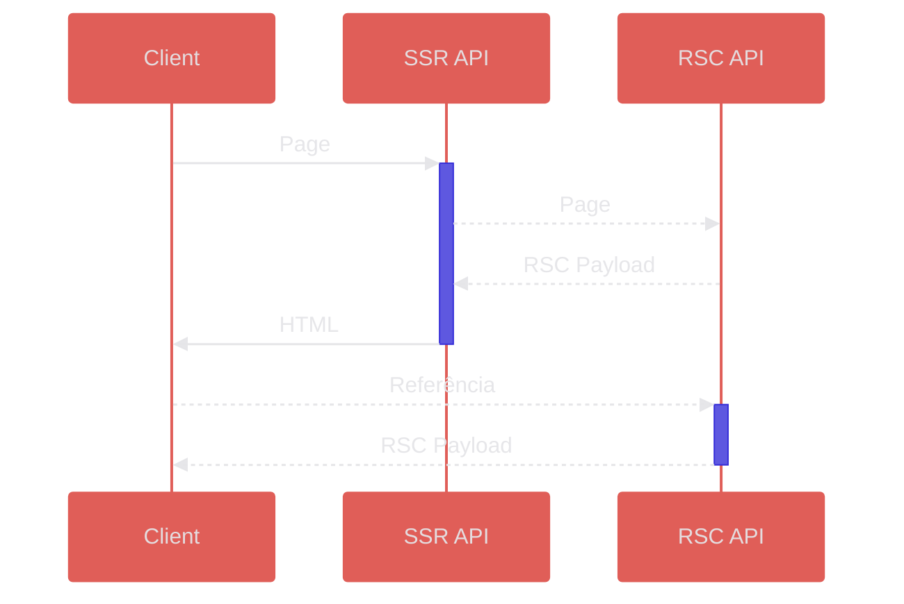

<h1 class="text-center">🏎</h1>

---
layout: center
---

# R19

---
layout: center
---

# Next.js do <span class="font-mono">0</span>

---

Ou;

# Criando um framework React 19 em menos de 100 linhas <span v-mark="{ padding: 16, iterations: 4, animationDuration: 2000, type: 'circle' }">de código</span>.

---
layout: center
---

### Um pouco de contexto;

---
layout: video
---

<video mute autoplay loop>
  <source src="/htnx.webm" type="video/webm">
</video>

---
layout: center
---

````md magic-move
<!-- prettier-ignore -->
```html
<button
  hx-trigger="click"
  hx-swap="innerHTML"
  hx-indicator="#spinner"
  hx-get="/random">
  Click me!
</button>
```

```tsx
"use client"

<HTNX
  element="button"
  trigger="click"
  swap="innerHTML"
  indicator={<Spinner />}
  action={random}>
  Click me!
</HTNX>
```
````

---

### O que é o **React 19**?

---

<v-clicks>

- Novos hooks e APIs
- React Server Components
- React Server Actions
- Compilador experimental 🤯

</v-clicks>

---

### Diferenças de **Server** / **Client** Components?

---

<v-clicks>

|                       | Renderiza no servidor?                                  | Renderiza no cliente?                                 |
| --------------------- | ------------------------------------------------------- | ----------------------------------------------------- |
| **Server Components** | <span class="text-bold text-emerald-500">✓</span>   | <span class="text-bold text-red-500">✗</span>     |
| **Client Components** | <span class="text-bold text-emerald-500">✓</span>\* | <span class="text-bold text-emerald-500">✓</span> |

</v-clicks>

---

### O que são **Server Actions**?

---

<div class="opacity-50 font-light mb-1">Funções que rodam no servidor e retornam algo para o cliente.</div>

<v-click>

## Em resumo, um RPC, integrado no React.

</v-click>

---

### **React 18** vs **React 19**

---
layout: center
---

<!-- Tenho minhas dúvidas se é necessário -->

````md magic-move
```tsx
async function create(data) {
  const response = await fetch("/api/post", {
    method: "POST",
    body: JSON.stringify(data)
  })

  return await response.json()
}

export default function CreateBlogPostForm() {
  const handleSubmit = async e => {
    e.preventDefault()

    const post = await create({
      title: e.target.title.value,
      content: e.target.content.value
    })

    window.location.href = `/blog/${post.slug}`
  }

  return (
    <form onSubmit={handleSubmit}>
      <input type="text" name="title" />
      <textarea name="content" />
      <button type="submit">Submit</button>
    </form>
  )
}
```

```tsx
async function create(data) {
  "use server"
  const post = await db.post.insert({
    title: data.get("title"),
    content: data.get("content")
  })
  redirect(`/blog/${post.slug}`)
}

export default function CreateBlogPostForm() {
  return (
    <form action={create}>
      <input type="text" name="title" />
      <textarea name="content" />
      <button type="submit">Submit</button>
    </form>
  )
}
```
````

---

<div class="opacity-50 font-light mb-1">Agora para o que interessa;</div>

<v-click>

## Criando um framework React 19

</v-click>

---

## Mas primeiro... <v-click>Como isso deveria funcionar?</v-click>

---



---

### RSC... Payload??

<v-clicks>

- Chamadas para `server actions`
- Importações de `client components`
- Revalidações de rotas

</v-clicks>

---

````md magic-move
```ts
// src/app/page.tsx
var Page = () => {
  const { counter } = db.query(`SELECT value FROM counter WHERE id = 1`).get();
  return /* @__PURE__ */ React2.createElement(React2.Fragment, null, /* @__PURE__ */ React2.createElement("main", {
    className: "m-4 border-4 border-dashed border-red-400 p-4"
  }, /* @__PURE__ */ React2.createElement(Suspense, {
    fallback: "Loading counter..."
  }, /* @__PURE__ */ React2.createElement(counter_default, {
    initValue: counter,
    action: _update
  }))
};
var page_default = Page;
export {
  page_default as default
};
```

```js
3:"$Sreact.suspense"
4:I["components/counter.js","default"]
6:I["components/toaster.js","default"]
2:{"name":"os_default","env":"Server","owner":null}
1:D"$2"
1:["$","b",null,{"children":["darwin"," ","arm64"]},"$2"]
5:{"id":"/build/components/actions.js#update","bound":null}
0:[["$","main",null,{"className":"m-4 border-4 border-dashed border-red-400 p-4","children":[[...]]]]
```
````

---
layout: center
---

## React Server Components <span v-mark.cross>_Server_</span>

<div class="text-center absolute top-[55%] left-1/2"><span v-click class="mt-2 opacity-50">•`_´•</span></div>

---
layout: center
---

## React Server Components _API_

---
layout: center
---

```ts {none|1,2,5,6,18,19|2,5|3|4|6,18|7|8|10-11|13-14|16|17|all}
express()
  .get("/*", async (req, res) => {
    let root = (await import(resolve("build/app", `.${req.path}/page.js`))).default(req.query)
    renderToPipeableStream(root, moduleBaseURL).pipe(res)
  })
  .post("/*", bodyParser.text(), async (req, res) => {
    const actionReference = String(req.headers["rsa-reference"]) // "build/components/actions.js#signup"
    const actionOrigin = String(req.headers["rsa-origin"]) // "/signup"

    const [filepath, name] = actionReference.split("#")
    const action = (await import(`.${resolve(filepath)}`))[name]

    let args = await decodeReply(req.body, moduleBaseURL)
    const returnValue = await action.apply(null, args)

    const root = (await import(resolve("build/app", `.${actionOrigin}/page.js`))).default(req.query)
    renderToPipeableStream({ returnValue, root }, moduleBaseURL).pipe(res)
  })
  .listen(3001)
```

---
layout: center
---

## Server-side Rendering _API_

---
layout: center
---

```tsx {none|1-2,15-16|3-4|6,14|7|8|10,13|all}
express()
  .get("/*", async (req, res) => {
    const url = new URL(req.url, `http://${req.headers.host}`)
    url.port = "3001" // Forward to the RSC server

    return http.get(url, async rsc => {
      let Root = () => use(createFromNodeStream(rsc, resolve("build/") + "/", moduleBaseURL))
      const Layout = (await import(resolve("build/_layout"))).default

      renderToPipeableStream(createElement(Layout, { children: createElement(Root) }), {
        bootstrapModules: ["/build/_client.js"],
        importMap: { ... }
      }).pipe(res)
    })
  })
  .listen(3000)
```

---

### E o que sobra pro **Client**?

---

<!-- Talvez mostrar como fica uma page dps do build -->

```ts {none|1,11|3-10|13-14|16|all}
const callServer = async (id: string, args: unknown[]) =>
  (
    await createFromFetch(
      fetch(getUrl(), {
        method: "POST",
        body: await encodeReply(args),
        headers: { "rsa-origin": location.pathname, "rsa-reference": id }
      }),
      { callServer, moduleBaseURL }
    )
  ).returnValue

const data = createFromFetch(fetch(getUrl()), { callServer, moduleBaseURL })
const Shell: FC<{ data: ReactNode }> = ({ data }) => use(data)

hydrateRoot(document.getElementById("root")!, createElement(Shell, { data }))
```

---

<div class="opacity-50 font-light mb-1">Bem legal, mas...</div>

<v-click>

## Isso funciona?

</v-click>

---
layout: video
---

<video mute autoplay loop>
  <source src="/works.mp4" type="video/mp4">
</video>

---

## E o código?

---
layout: smol
---

```ts
export const createReference = (e: string, path: string, directive: string) => {
  const id = `/${relative(".", path).replace("src", "build").replace(/\..+$/, ".js")}#${e}`
  const mod = `${e === "default" ? parse(path).base.replace(/\..+$/, "") : ""}_${e}`
  return directive === "server"
    ? `const ${mod}=()=>{throw new Error("This function is expected to only run on the server")};${mod}.$$typeof=Symbol.for("react.server.reference");${mod}.$$id="${id}";${mod}.$$bound=null;${e === "default" ? `export{${mod} as default}` : `export {${mod} as ${e}}`};`
    : `${e === "default" ? "export default {" : `export const ${e} = {`}$$typeof:Symbol.for("react.client.reference"),$$id:"${id}",$$async:true};`
}

// Entries
await Bun.$`rm -rf ./build/`
const entries = (await readdir(resolve("src"), { recursive: true })).reduce(
  (acc, file) => {
    const ext = file.match(/\..+$/)
    if (!ext) return acc
    const path = resolve("src", file)
    if (file.endsWith("page.tsx")) acc["pages"].push(path)
    else if (ext[0].match(/\.tsx?$/)) acc["components"].push(path)
    else acc["assets"].push(path)
    return acc
  },
  { pages: [], components: [], assets: [] } as Record<string, string[]>
)

// Building + Bundling
await Bun.build({
  target: "bun",
  entrypoints: entries["pages"],
  external: ["react", "react-dom"],
  outdir: resolve("build", "app"),
  plugins: [
    {
      name: "rsc-register",
      setup: build =>
        build.onLoad({ filter: /\.tsx?$/ }, async args => {
          const content = await Bun.file(args.path).text()
          const directives = content.match(/(?:^|\n|;)"use (client|server)";?/)
          if (!directives) return { contents: content }
          const { exports } = new Bun.Transpiler({ loader: "tsx" }).scan(content)
          if (exports.length === 0) return { contents: content }
          return { contents: exports.map(e => createReference(e, args.path, directives[1])).join("\n") }
        })
    }
  ]
})
await Bun.build({
  target: "bun",
  external: ["react", "react-dom", "@physis/react-server-dom-esm"],
  entrypoints: entries["components"],
  root: resolve("src"),
  outdir: resolve("build")
})
entries["assets"].forEach(asset => Bun.write(asset.replace("src", "build"), Bun.file(asset)))
```

```ts
// Server-side Rendering API
express()
  .use(
    (_, res, next) => (
      res.header("Access-Control-Allow-Origin", "*").header("Access-Control-Allow-Headers", "*"), next()
    )
  )
  .get("/*", async (req, res) =>
    renderToPipeableStream(
      (await import(resolve("build/app", `.${req.path}/page.js`))).default(req.query),
      "/build/"
    ).pipe(res)
  )
  .post("/*", bodyParser.text(), async (req, res) => {
    const [filepath, name] = String(req.headers["rsa-reference"]).split("#")
    const returnValue = await (
      await import(`.${resolve(filepath)}`)
    )[name].apply(null, await decodeReply(req.body, "/build/"))
    const root = (
      await import(resolve("build/app", `.${String(req.headers["rsa-origin"])}/page.js`))
    ).default(req.query)
    renderToPipeableStream({ returnValue, root }, "/build/").pipe(res)
  })
  .listen(3001)

// React Server Components API
express()
  .use("/build", express.static("build"))
  .use("/node_modules", express.static("node_modules"))
  .get(/\.(?!js).+$/, express.static("build"))
  .get("/*", async (req, res) => {
    const url = new URL(req.url, `http://${req.headers.host}`)
    return http.get(((url.port = "3001"), url), async rsc => {
      let Root = () => use(createFromNodeStream(rsc, resolve("build/") + "/", "/build/"))
      renderToPipeableStream(
        createElement((await import(resolve("build/_layout"))).default, { children: createElement(Root) }),
        {
          bootstrapModules: ["/build/_client.js"],
          importMap: {
            imports: {
              react: "https://esm.sh/react@next",
              "react-dom": "https://esm.sh/react-dom@next",
              "react-dom/": "https://esm.sh/react-dom@next/",
              "@physis/react-server-dom-esm/client":
                "/node_modules/@physis/react-server-dom-esm/esm/react-server-dom-esm-client.browser.development.js"
            }
          }
        }
      ).pipe(res)
    })
  })
  .listen(3000)
```

---

<div class="opacity-50 font-light mb-1">Ainda falta alguma coisa...</div>

<v-clicks>

### E as...

# Linhas??

</v-clicks>

---

```rs
-------------------------------------------------------------------------------
Language                     files          blank        comment           code
-------------------------------------------------------------------------------
TypeScript                       3              3              4             99
-------------------------------------------------------------------------------
```

---
layout: video
---


---
layout: center
---

### Obrigado!

---
layout: qr-code
---


